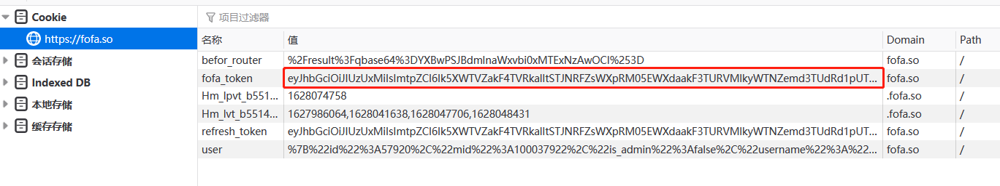
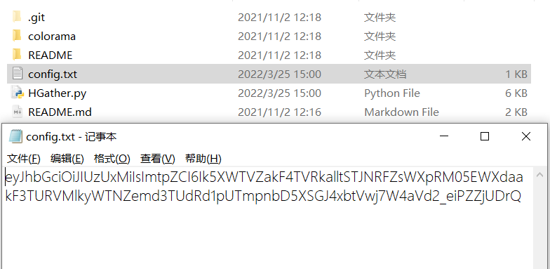
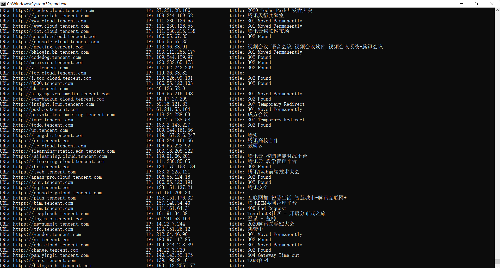

# HGather

## 资产收集工具——HGather by 白泽Sec-ahui

联系方式：aaaahuia@163.com

### 工具简述：

基于fofa资产搜索引擎进行资产收集，快速检索目标条件下的IP，URL以及标题，适用于资产较多时对模糊资产的快速检索。

### 使用方法：

##### 使用环境：python2

使用前需网页端登录fofa获取cookie中的fofa-token值并存为同目录下config.txt





##### 参数：

```
  -h, --help            show this help message and exit
  -q QBASE64, --qbase64 QBASE64
                        指定FOFA中的搜索条件（base64编码）
  -i IP, --ip IP        指定要搜索的IP或IP段，例如：-i 192.168.0.1/24
  -o OUT, --out OUT     指定要导出的文件名，例如：-o test.txt
```

##### Example Usages：

**将符合FOFA语法的语句进行base64编码即可：**

```
domain="tencent.com" base64-> ZG9tYWluPSJ0ZW5jZW50LmNvbSI=
title="腾讯" base64-> dGl0bGU9In6vIg==

python2 hgather.py -q ZG9tYWluPSJ0ZW5jZW50LmNvbSI=
python2 hgather.py -q ZG9tYWluPSJ0ZW5jZW50LmNvbSI= -o result.txt
```

**直接指定IP或IP段：**

```
python2 hgather.py -i 220.181.111.113
python2 hgather.py -i 220.181.111.113/16
python2 hgather.py -i 220.181.111.113/24 -o result.txt
```

执行结果图如下：



