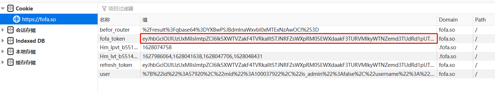
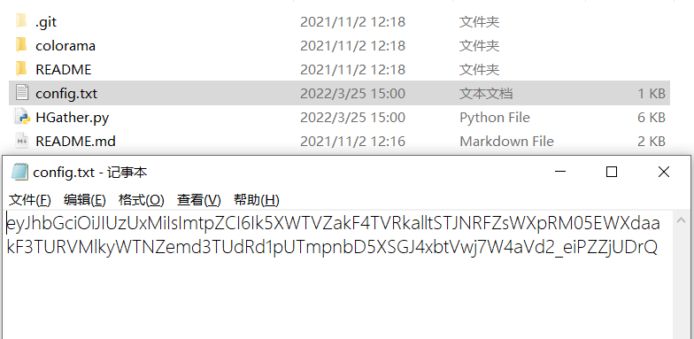

# HGather

## 资产收集工具——HGather by 白泽Sec-ahui

联系方式：aaaahuia@163.com

### 工具简述：

资产收集+C段整理二合一

基于fofa资产搜索引擎进行资产收集，快速检索目标条件下的IP，URL以及标题，适用于资产较多时对模糊资产的快速检索，新增C段整理功能，整理出资产处于的IPC段并统计。

### 使用方法：

##### 使用环境：python2

使用前需网页端登录fofa获取cookie中的fofa-token值并存为同目录下config.txt





##### 参数：

```
  -h, --help            show this help message and exit
  -q QUERY STRING, --qstr QUERY STRING
                        指定FOFA中的搜索条件，必须符合fofa语法(语句中不用带引号，fofa语句中有空格则需要用引号包裹q参数)
  -i IP, --ip IP        指定要搜索的IP或IP段，例如：-i 192.168.0.1/24
  -o OUT, --out OUT     指定要导出的文件名，例如：-o test.txt
```

##### Example Usages：

**将符合FOFA语法的语句输入即可：**

```
python2 HGather.py -q title=腾讯
python2 HGather.py -q domain=tencent.com -o result.txt
python2 HGather.py -q "domain=tencent.com && is_domain=true"
```

**直接指定IP或IP段：**

```
python2 HGather.py -i 220.181.111.113
python2 HGather.py -i 220.181.111.113/16
python2 HGather.py -i 220.181.111.113/24 -o result.txt
```

执行结果图如下：


